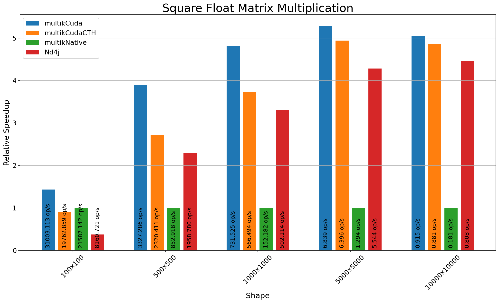
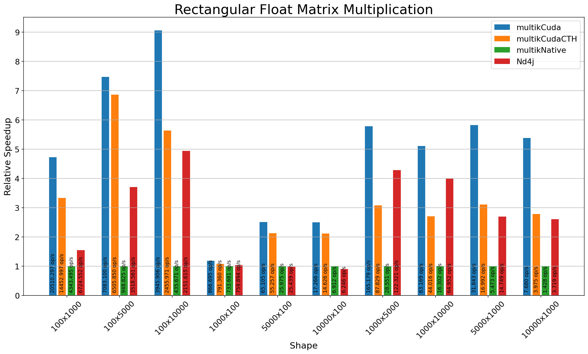

# Multik Cuda Benchmarks
The purporse of these becnhamarks is to compare performance of multik-cuda with other implementations (mainly Multik Native).

Benchmars are done via JMH toolkit.

## Specs
| Spec | Value                               |
|------|-------------------------------------|
| CPU  | Intel Core i7-8750H @ 2.20GHz       |
| GPU  | GP107M [GeForce GTX 1050 Ti Mobile] |
| OS   | Ubuntu 20.04.2 LTS                  |

## Plots
#### Legend:
* `multikCuda` - dot using Cuda module with cudaDeviceSynchronize call right after  
* `multikCudaCTH` - dot using Cuda module with copy to host triggered right after
* `multikNative` - dot using Native module, which uses OpenBLAS under the hood
* `Nd4j` - nd4j mmul using CUDA backend

#### Y axis shows Relative Speedup compared to Multik Native implementation.

## Note

`multikCuda` and `multikCTH` benchmark methods are using memory optimizations while Nd4j is executed without any optimizations (as far as I'm aware). Nd4j is shown here just for reference of a solid CUDA implementation.
